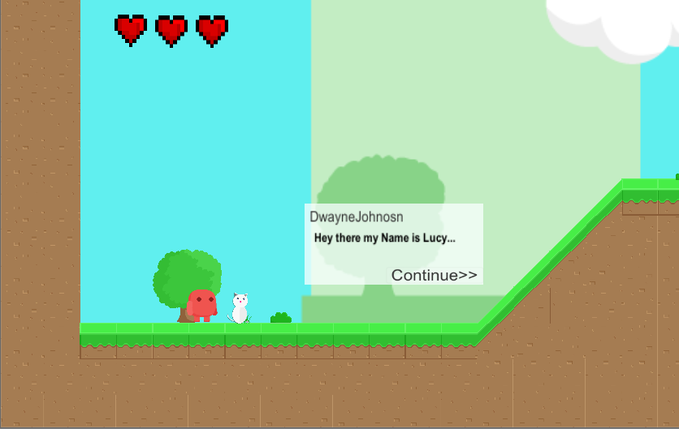
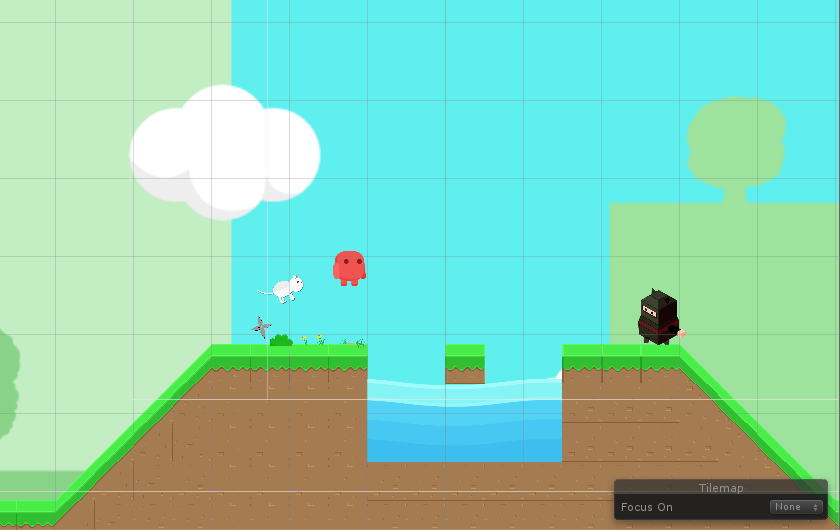

# My First Plattformer

This Project was a small fun project, in order to learn the basics from C# and game developement.

## Getting Started
Clone the repository and import it to Unity.

### Prerequisites

Just download Unity on the Website: https://unity3d.com/de

## Built With

* [Unity](https://unity3d.com/de) - The Game Dev Framework
* [Maven](https://inkscape.org/de/) - Created Models with it

## Some Impressions
<ul align="center">
<li> 
The Goal of the Game is to bring Lucy home!  

</li>
<li> 
You Have to doge Enemies and Obstacles  

</li>

<li> 
The Goal is to reach the flag!  

</li>

<li> 
You have 3 hearts and you may loose if you get hit by an obstacle or enemy   

</li>
<li> 
This is how the game looks inside the Unity Editor   

</li>

</ul>

<ul> I Have created a lot of the assets my self:
<li>The cat "Lucy" </li>
<li>The ninja enemy </li>
<li>The Game Over Screen </li>
<li>The Goal (Flag)</li>
<li>The hearts </li>

</ul>

## License

This project is licensed under the MIT License - see the [LICENSE.md](LICENSE.md) file for details

